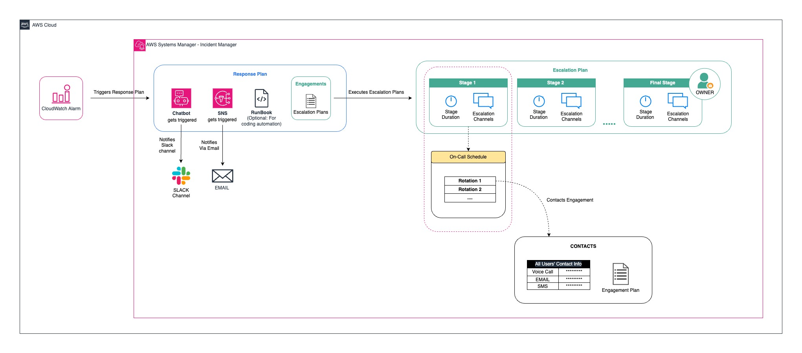

# Terraform AWS Infrastructure Overview

This Terraform code configures and manages **AWS Incident Manager resources**, including **contacts**, **on-call schedules**, **escalation plans**, and **response plans**. The resources are currently structured within a single module to ensure smooth functionality and quick deployment. In the future, the resources will be modularized.

## Key Features

### Contacts
- **Personal Contacts**: Each contact is defined with an alias, email, and mobile number. Terraform dynamically generates a unique alias for each contact.
- **Contact Channels**: Email, SMS, and phone channels are assigned to each contact based on the available information. Only contacts with valid email or mobile numbers are included.
  
**Example**:
- Contacts with emails are configured for email delivery.
- Contacts with mobile numbers are configured for SMS and voice channels.

### On-Call Schedule
- **On-call Rotations**: The configuration includes on-call schedules for different shifts (morning, evening, night). The schedule dynamically assigns contacts based on the shift configuration.
- **Time Zones & Hand-off**: Each shift specifies the timezone and hand-off time between contacts to ensure smooth transition and coverage.

### Escalation Plan
- **Escalation Stages**: Each escalation plan has multiple stages with contacts dynamically assigned to each stage. The duration of each stage is configurable.
- **Target Contacts**: Contacts for escalation stages are sourced based on predefined schedules and mapped to their respective stages automatically.

### Response Plan
- **Incident Response Plans**: Response plans are created to manage incidents with specific templates, including incident titles, descriptions, and impact levels.
- **Engagement Plans**: Each response plan can trigger engagement through escalation plans, ensuring key contacts are notified during incidents.

## Inputs
- **Contacts**: A map of contact details including name, email, and mobile number.
- **On-call Schedule**: A list of contacts assigned to on-call schedules and their respective shift details.
- **Escalation Plans**: Defines the escalation plans, including target contacts and stage configurations.
- **Response Plans**: A list of response plans, including incident titles, impact levels, and engagement plans.

## Outputs
- **Escalation Mapping**: Outputs a map of escalation plan ARNs.
- **Mapped Stages**: Outputs the defined stages and corresponding contacts for the escalation plan.
- **Response Plan**: Outputs the details of the response plans, including engagement mappings and incident templates.

## Usage
This Terraform configuration manages critical resources within **AWS Incident Manager**, ensuring rapid response and escalation during incidents. All resources are designed to ensure effective communication and escalation, dynamically sourcing contact ARNs and mapping them into the appropriate schedules or escalation plans.

To deploy the infrastructure:

1. Define the input variables for **contacts**, **on-call schedules**, **escalation plans**, and **response plans** in your `.tfvars` file.
2. Run `terraform apply` to deploy the infrastructure and configure the resources.
3. Output values such as contact ARNs, on-call schedules, and escalation mappings are automatically generated for use within the incident management workflow.

## Future Enhancements
The current structure is optimized for quick deployment and functional testing. Moving forward, the configuration will be modularized for better scalability and management, but the core functionality will remain unchanged.

