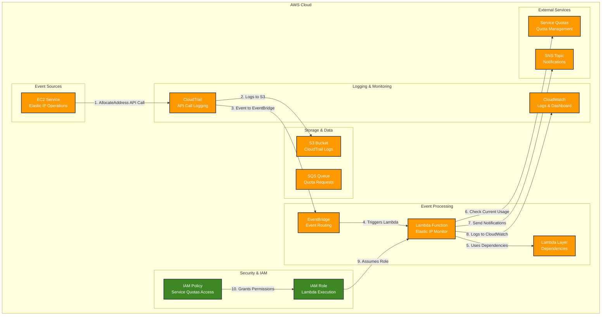
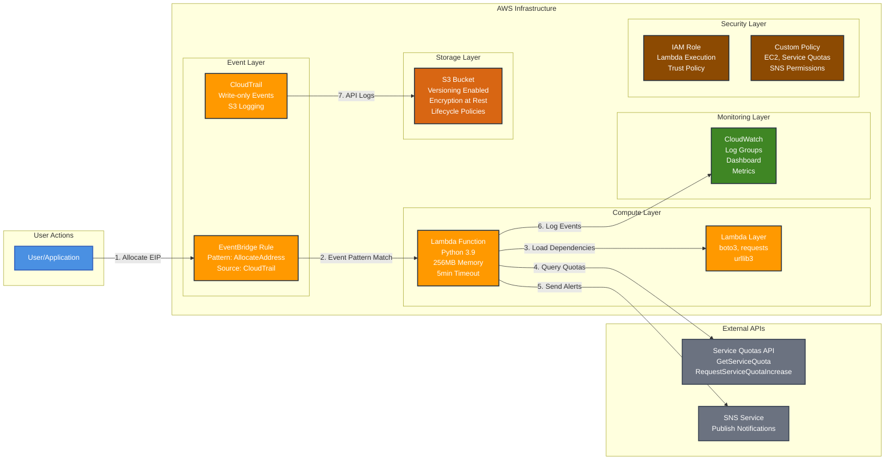
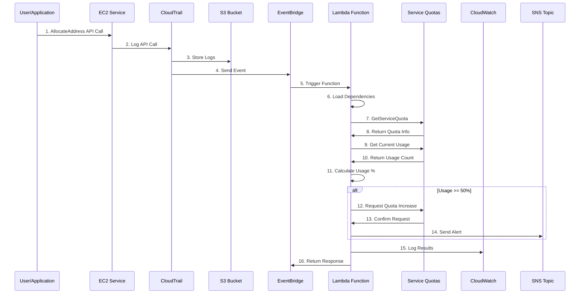
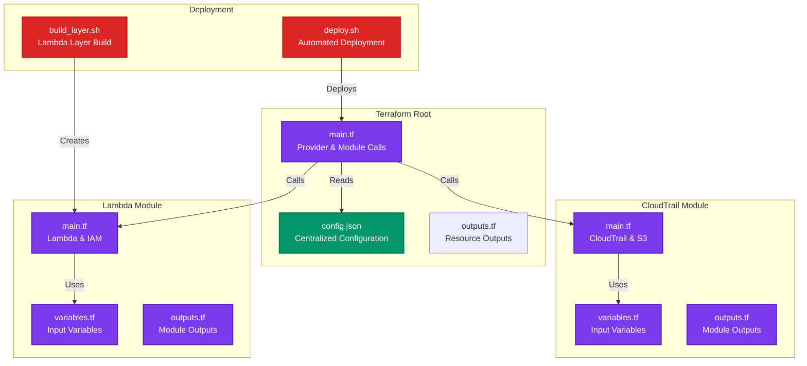
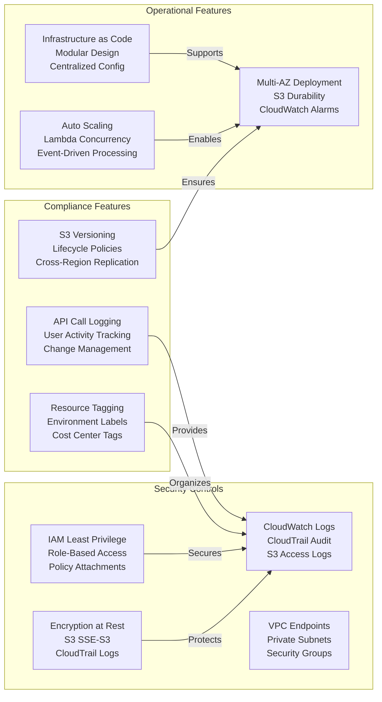

# AWS Elastic IP Monitoring Solution - Architecture Diagram

## System Overview
This solution provides automated monitoring and quota management for AWS Elastic IPs using a serverless architecture with real-time event processing.

## Architecture Components

## Detailed Component Architecture

## Data Flow Sequence

## Infrastructure as Code Structure

## Security & Compliance Features

## Performance & Scaling Characteristics

- **Lambda Function**: 
  - Memory: 256MB (configurable)
  - Timeout: 5 minutes (configurable)
  - Concurrent executions: Auto-scaling
  - Cold start: ~300ms typical
  
- **EventBridge**: 
  - Event processing: <100ms
  - Throughput: 10,000 events/second
  - Reliability: 99.99% SLA
  
- **CloudTrail**: 
  - Log delivery: <15 minutes
  - Storage: S3 with lifecycle policies
  - Retention: Configurable (default: 90 days)
  
- **S3**: 
  - Durability: 99.999999999%
  - Availability: 99.99%
  - Encryption: AES-256

## Cost Optimization Features

- **Lambda**: Pay-per-execution model
- **S3**: Intelligent tiering and lifecycle policies
- **CloudTrail**: Free tier available
- **EventBridge**: Pay-per-event model
- **CloudWatch**: Basic monitoring included

## High Availability Features

- **Multi-AZ**: Automatic failover
- **S3**: 99.99% availability SLA
- **Lambda**: Regional redundancy
- **CloudWatch**: Global service
- **EventBridge**: Regional service with cross-region capabilities
