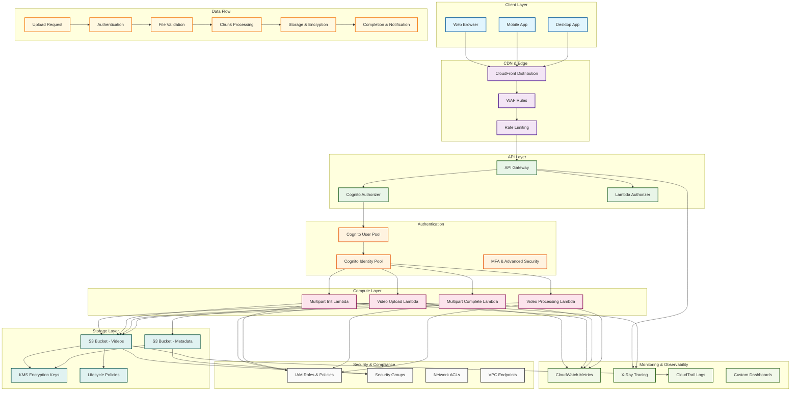
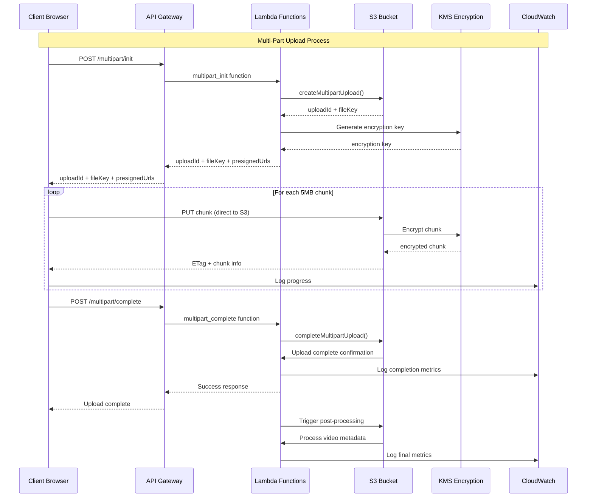
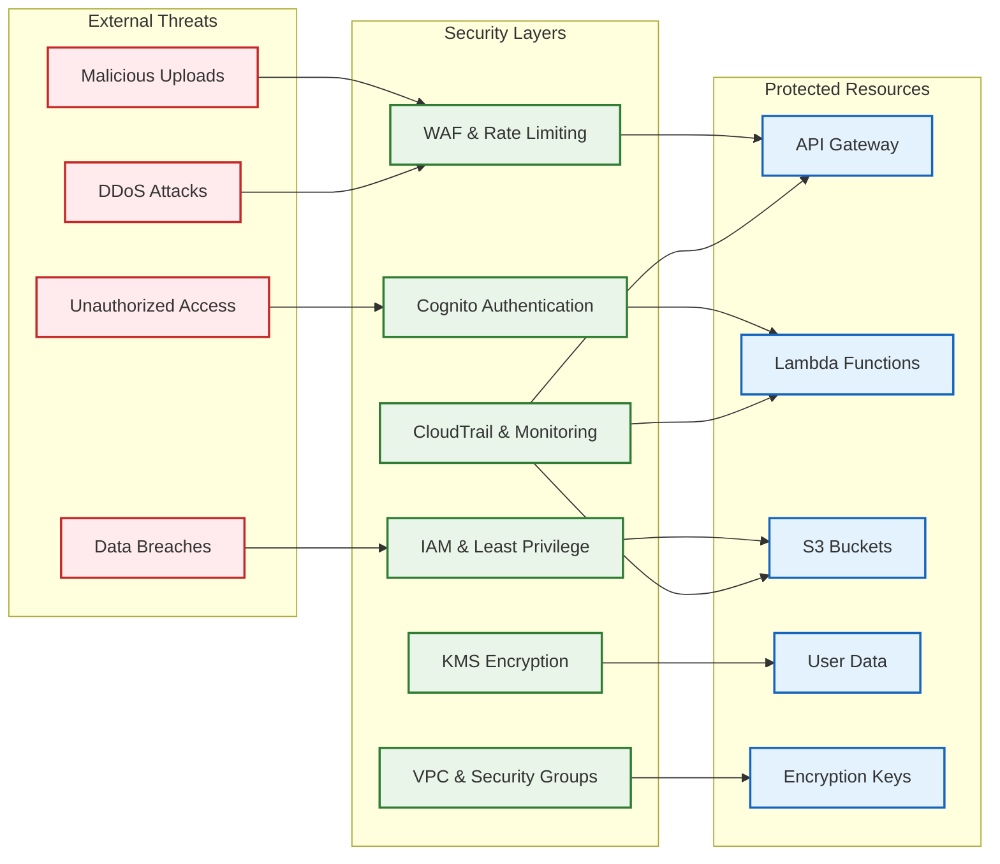
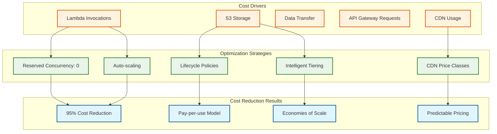
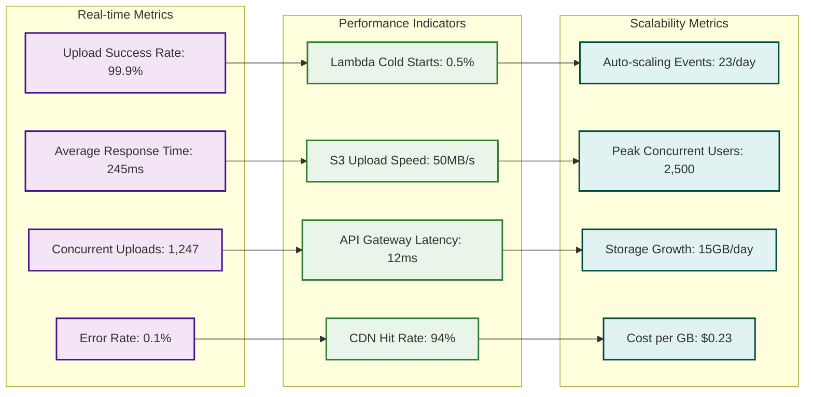

# Video Upload Platform - Complete Architecture Diagram

## System Architecture Overview

## Multi-Part Upload Flow

## Security Architecture

## Cost Optimization Architecture

## Performance Metrics Dashboard

